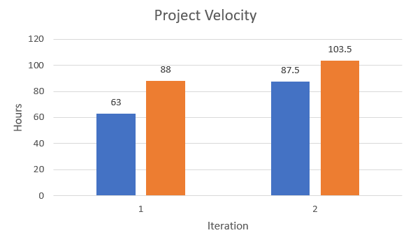

# Retrospective

## Discuss a part of your project that has not been as successful as you would have liked, and how it can be improved in this iteration (do this early!).

Throughout the project, several issues hindered our success. 

- Time management was lacking, causing delays and reduced productivity. To improve, we must prioritize tasks, set realistic deadlines, and enhance accountability.
- Merge conflicts disrupted our development process. Better version control practices, frequent pulls, and open communication can prevent conflicts and improve collaboration. 
- Pushing numerous issues to iteration 3 affected project completion. To avoid this, thorough analysis of requirements and setting achievable milestones are necessary. 
- Peer review was inconsistent, impacting code quality. Formalizing the process with designated reviewers and using code review tools can ensure comprehensive feedback. 
- Planning deficiencies led to unforeseen challenges. In iteration 3, invest more time in detailed planning. 
- Uneven work distribution caused burnout and stress. Assess team member strengths and communicate workload concerns for better balance.

## Determine concrete (and realistic) ways of improvement, and decide how its success will be evaluated at the end of the iteration (measurable and objective).

- We can distribute the workload more. Its success will be evaluated by the number of issues closed by each member.
- Peer reviews are the same. We can measure the success by looking at how many merge requests each member reviewed.
- Time management can be improved by setting realistic deadlines. We can see its success by looking if we hit the deadlines or not.

## Project Velocity

