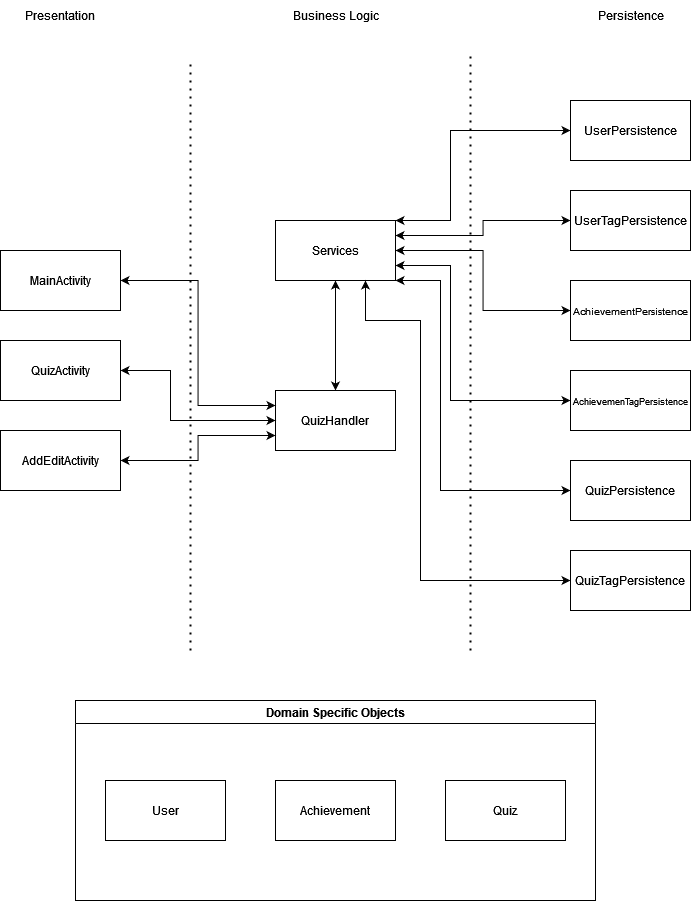
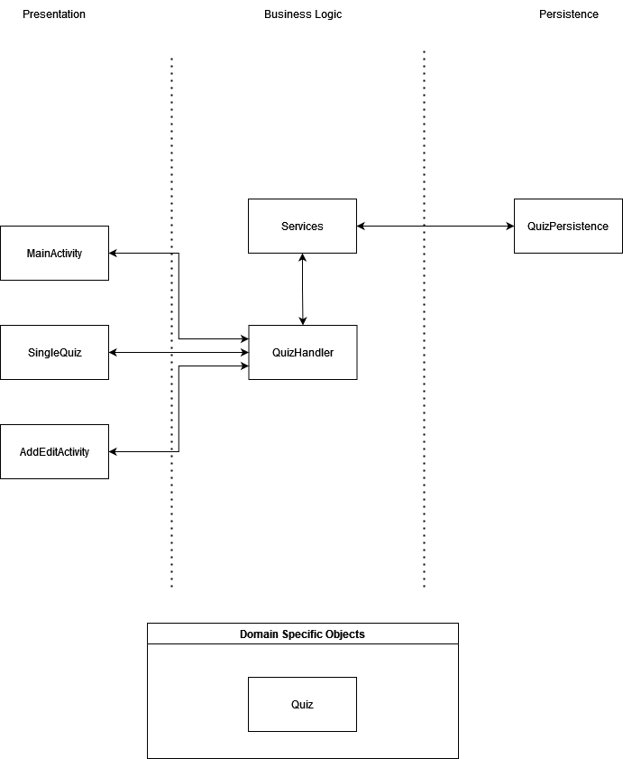

# Architecture

## Overall Diagram
This may change.

## Iteration 1 Diagram

## Presentation Layer

### [MainActivity](https://code.cs.umanitoba.ca/3350-summer2023/lakers-6/-/blob/main/app/src/main/java/comp3350/lakers/quizme/presentation/MainActivity.java)
`MainActivity` displays the list of quizzes. It also has a delete button and an add button, which
deletes and add a quiz, respectively. Pressing the add button brings the user to a new
page (`InsertQuiz`)

### [InsertQuiz](https://code.cs.umanitoba.ca/3350-summer2023/lakers-6/-/blob/main/app/src/main/java/comp3350/lakers/quizme/presentation/InsertQuiz/InsertQuizFragment.java)
In `InsertQuiz`, a user can pick between a long answer question or a multiple choice question. There
a few things that can be done on this page:

- Add the quiz's category
- Add the quiz's name
- Add the question
- Add the answer
    - For multiple choice questions, the user can put down up to 4 choices.

If the user is satisfied, they can press the `>` button and the newly created quiz will be
inserted in the database. They can also choose not to insert a quiz by pressing the `X` button on
the bottom left
corner.

Please note that for iteration 1, you can make an empty quiz. Our goal was to get it up and running.
This will be fixed in future iterations.

### [SingleQuiz](https://code.cs.umanitoba.ca/3350-summer2023/lakers-6/-/blob/main/app/src/main/java/comp3350/lakers/quizme/presentation/SingleQuiz.java)
The `SingleQuiz` page is responsible for displaying the question. In here, a user can either type
their answer (for long answer questions) or pick an answer from the list of choices (multiple choice
question).

## Business Layer

### [QuizHandler](https://code.cs.umanitoba.ca/3350-summer2023/lakers-6/-/blob/main/app/src/main/java/comp3350/lakers/quizme/logic/QuizHandler.java)
The `QuizHandler` is the logic layer that talks to the service and the presentation layer. It contains:
- `getSize()`
- `getQuiz`
- `insertQuiz`
- `getQuizList`
- `deleteQuiz`

### [Service](https://code.cs.umanitoba.ca/3350-summer2023/lakers-6/-/blob/main/app/src/main/java/comp3350/lakers/quizme/logic/Service.java)
`Service` is the main connection between the logic layer and the persistence layer.

## Persistence Layer

## [IQuiz](https://code.cs.umanitoba.ca/3350-summer2023/lakers-6/-/blob/main/app/src/main/java/comp3350/lakers/quizme/persistence/IQuiz.java)
This is interface for the persistence layer.

## [QuizData](https://code.cs.umanitoba.ca/3350-summer2023/lakers-6/-/blob/main/app/src/main/java/comp3350/lakers/quizme/persistence/mockdata/QuizData.java)
`QuizData` implements IQuiz

## Domain Specific Objects

### [Quiz](https://code.cs.umanitoba.ca/3350-summer2023/lakers-6/-/blob/main/app/src/main/java/comp3350/lakers/quizme/objects/questions/Question.java)
`Quiz` is an abstract class that houses:
- `question`
- `quizName`
- `category`
- `answer`

### [Multiple Choice Quizzes](https://code.cs.umanitoba.ca/3350-summer2023/lakers-6/-/blob/main/app/src/main/java/comp3350/lakers/quizme/objects/questions/MultipleChoiceQuestion.java)
`MultipleChoice` extends Quiz
### [Long Answer Quizzes]()
`LongAnswer` extends Quiz