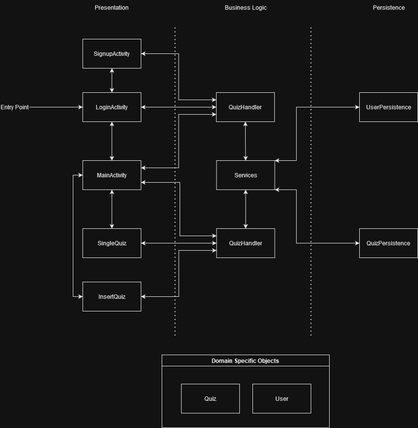

# Architecture-2

## Iteration 2 Diagram

## Presentation Layer

### [LoginActivity](https://code.cs.umanitoba.ca/3350-summer2023/lakers-6/-/blob/main/app/src/main/java/comp3350/lakers/quizme/presentation/LoginActivity.java)
`LoginActivity` logs the user in. There's also a link that brings the user to the sign up page. If the user is logged in, then the app jumps straight to the main activity.

NB: use `Username: america1776` and `Password: suckItEngland` to login.

### [SignupActivity](https://code.cs.umanitoba.ca/3350-summer2023/lakers-6/-/blob/main/app/src/main/java/comp3350/lakers/quizme/presentation/SignupActivity.java)
`SignupActivity` allows the user to sign up.

### [MainActivity](https://code.cs.umanitoba.ca/3350-summer2023/lakers-6/-/blob/main/app/src/main/java/comp3350/lakers/quizme/presentation/MainActivity.java)
`MainActivity` displays the list of quizzes. It also has an add button which adds a quiz. Pressing the add button brings the user to a new page (`InsertQuiz`). A user can press and hold to delete a quiz (press the word).

### [InsertQuiz](https://code.cs.umanitoba.ca/3350-summer2023/lakers-6/-/blob/main/app/src/main/java/comp3350/lakers/quizme/presentation/InsertQuiz/InsertQuizFragment.java)
In `InsertQuiz`, a user can pick between a long answer question or a multiple choice question. There
a few things that can be done on this page:

- Add the quiz's category
- Add the quiz's name
- Add the question
- Add the answer
    - For multiple choice questions, the user can put down up to 4 choices.

If the user is satisfied, they can press the `>` button and the newly created quiz will be
inserted in the database. They can also choose not to insert a quiz by pressing the `X` button on
the bottom left corner.

Please note that for iteration 1, you can make an empty quiz. Our goal was to get it up and running.
This will be fixed in future iterations.

### [SingleQuiz](https://code.cs.umanitoba.ca/3350-summer2023/lakers-6/-/blob/main/app/src/main/java/comp3350/lakers/quizme/presentation/SingleQuiz.java)
The `SingleQuiz` page is responsible for displaying the question. In here, a user can either type
their answer (for long answer questions) or pick an answer from the list of choices (multiple choice
question).

## Logic/Business Layer

### [QuizHandler](https://code.cs.umanitoba.ca/3350-summer2023/lakers-6/-/blob/main/app/src/main/java/comp3350/lakers/quizme/logic/QuizHandler.java)
The `QuizHandler` is the logic layer that talks to the quiz persistence and the presentation layer.

### [UserHandler](https://code.cs.umanitoba.ca/3350-summer2023/lakers-6/-/blob/main/app/src/main/java/comp3350/lakers/quizme/logic/UserHandler.java)
The `UserHandler` is the logic layer that talks to the user persistence and the presentation.

## Persistence Layer

## [IQuiz](https://code.cs.umanitoba.ca/3350-summer2023/lakers-6/-/blob/main/app/src/main/java/comp3350/lakers/quizme/persistence/IQuiz.java)
This is interface for the quiz persistence layer.

## [IUser](https://code.cs.umanitoba.ca/3350-summer2023/lakers-6/-/blob/7e2de4ffdc813180d04ff13e76f6436e54878de6/app/src/main/java/comp3350/lakers/quizme/persistence/IUser.java)
This is interface for the user persistence layer.

## [QuizStub](https://code.cs.umanitoba.ca/3350-summer2023/lakers-6/-/blob/7e2de4ffdc813180d04ff13e76f6436e54878de6/app/src/main/java/comp3350/lakers/quizme/persistence/stubs/QuizStub.java)
`QuizStub` holds the fake quiz database.

## [UserStub](https://code.cs.umanitoba.ca/3350-summer2023/lakers-6/-/blob/7e2de4ffdc813180d04ff13e76f6436e54878de6/app/src/main/java/comp3350/lakers/quizme/persistence/stubs/UserStub.java)
`UserStub` holds the fake user database.

## [QuizPersistenceHSQLDB](https://code.cs.umanitoba.ca/3350-summer2023/lakers-6/-/blob/7e2de4ffdc813180d04ff13e76f6436e54878de6/app/src/main/java/comp3350/lakers/quizme/persistence/hsqldb/QuizPersistenceHSQLDB.java)
`QuizPersistenceHSQLDB` is responsible for connecting to the quiz table.

## [UserPersistenceHSQLDB](https://code.cs.umanitoba.ca/3350-summer2023/lakers-6/-/blob/7e2de4ffdc813180d04ff13e76f6436e54878de6/app/src/main/java/comp3350/lakers/quizme/persistence/hsqldb/UserPersistenceHSQLDB.java)
`UserPersistenceHSQLDB` talks to the user table

## Domain Specific Objects

### [Quiz](https://code.cs.umanitoba.ca/3350-summer2023/lakers-6/-/blob/main/app/src/main/java/comp3350/lakers/quizme/objects/questions/Question.java)
`Quiz` is an abstract class that houses:
- `question`
- `quizName`
- `category`
- `answer`

### [Multiple Choice Quizzes](https://code.cs.umanitoba.ca/3350-summer2023/lakers-6/-/blob/main/app/src/main/java/comp3350/lakers/quizme/objects/questions/MultipleChoiceQuestion.java)
`MultipleChoice` extends Quiz. It also stores choices.
### [Long Answer Quizzes]()
`LongAnswer` extends Quiz

### [User](https://code.cs.umanitoba.ca/3350-summer2023/lakers-6/-/blob/7e2de4ffdc813180d04ff13e76f6436e54878de6/app/src/main/java/comp3350/lakers/quizme/objects/user/User.java)
`User` contains relevant information about the user

## Application

### [Service](https://code.cs.umanitoba.ca/3350-summer2023/lakers-6/-/blob/main/app/src/main/java/comp3350/lakers/quizme/logic/Service.java)
`Service` is the main connection between the logic layer and the persistence layer.
