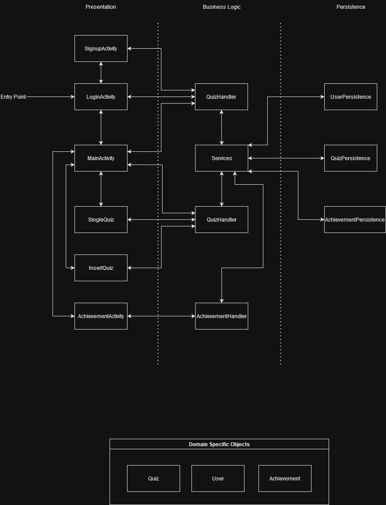

# Architecture-Final
## Diagram

## Presentation Layer
| Class Name    | Description                                                                                                                                                 | Link |
|---------------|-------------------------------------------------------------------------------------------------------------------------------------------------------------|------|
| LoginActivity | Logs the user in. There's also a link that brings the user to the sign up page. If the user is logged in, then the app jumps straight to the main activity. |[LoginActivity](https://code.cs.umanitoba.ca/3350-summer2023/lakers-6/-/blob/main/app/src/main/java/comp3350/lakers/quizme/presentation/LoginActivity.java)   |
| SignupActivity| Allows the user to sign up.                                                                                                                                 |[SignupActivity](https://code.cs.umanitoba.ca/3350-summer2023/lakers-6/-/blob/main/app/src/main/java/comp3350/lakers/quizme/presentation/SignupActivity.java)      |
| MainActivity  | Displays the list of quizzes. Also contains the add, delete, edit, and star button                                                                          |[MainActivity](https://code.cs.umanitoba.ca/3350-summer2023/lakers-6/-/blob/main/app/src/main/java/comp3350/lakers/quizme/presentation/MainActivity.java)     |
| InsertQuiz    | In `InsertQuiz`, a user can pick between a long answer question or a multiple choice question. There a few things that can be done on this page: <ul><li> Add the quiz's category </li><li> Add the quiz's name </li><li> Add the question </li><li> Add the answer <ul><li>For multiple choice questions, the user can put down up to 4 choices</li></ul></li></ul> | [InsertQuiz](https://code.cs.umanitoba.ca/3350-summer2023/lakers-6/-/blob/main/app/src/main/java/comp3350/lakers/quizme/presentation/InsertQuiz/InsertQuizFragment.java)|
| SingleQuiz	| The `SingleQuiz` page is responsible for displaying the question. In here, a user can either type their answer (for long answer questions) or pick an answer from the list of choices (multiple choice question). | [SingleQuiz](https://code.cs.umanitoba.ca/3350-summer2023/lakers-6/-/blob/main/app/src/main/java/comp3350/lakers/quizme/presentation/SingleQuiz.java) | 
| AchievementsActivity[^new]| Displays the user's achievements. | [AchievementsActivity](https://code.cs.umanitoba.ca/3350-summer2023/lakers-6/-/blob/main/app/src/main/java/comp3350/lakers/quizme/presentation/AchievementsActivity.java) |

## Logic/Business Layer
| Class Name    | Description                                                                                                                                                 | Link |
|---------------|-------------------------------------------------------------------------------------------------------------------------------------------------------------|------|
| QuizHandler 	| Talks to the Service class | [QuizHandler](https://code.cs.umanitoba.ca/3350-summer2023/lakers-6/-/blob/main/app/src/main/java/comp3350/lakers/quizme/logic/QuizHandler.java)   |
| UserHandler	| Talks to the Service class |[UserHandler](https://code.cs.umanitoba.ca/3350-summer2023/lakers-6/-/blob/main/app/src/main/java/comp3350/lakers/quizme/logic/UserHandler.java) |
| AchievementHandler[^new] | Talks to the Service class | [AchievementHandler](https://code.cs.umanitoba.ca/3350-summer2023/lakers-6/-/blob/main/app/src/main/java/comp3350/lakers/quizme/logic/AchievementHandler.java) |
| UPValidator 	| Handles username and password validation | [UPValidator](https://code.cs.umanitoba.ca/3350-summer2023/lakers-6/-/blob/main/app/src/main/java/comp3350/lakers/quizme/logic/utils/UPValidator.java) |
| QuizValidator | Handles quiz related input validation | [QuizValidator](https://code.cs.umanitoba.ca/3350-summer2023/lakers-6/-/blob/main/app/src/main/java/comp3350/lakers/quizme/logic/utils/QuizValidator.java) |
## Persistence Layer
| Class Name    | Description                                                                                                                                                 | Link |
|---------------|-------------------------------------------------------------------------------------------------------------------------------------------------------------|------|
| IQuiz 		| Interface of the quiz persistence | [IQuiz](https://code.cs.umanitoba.ca/3350-summer2023/lakers-6/-/blob/main/app/src/main/java/comp3350/lakers/quizme/persistence/IQuiz.java)   |
| IUser 		| Interface of the user persistence | [IUser](https://code.cs.umanitoba.ca/3350-summer2023/lakers-6/-/blob/7e2de4ffdc813180d04ff13e76f6436e54878de6/app/src/main/java/comp3350/lakers/quizme/persistence/IUser.java)|
| IAchievement[^new]	| Interface of the achievements persistence | [IAchievement](https://code.cs.umanitoba.ca/3350-summer2023/lakers-6/-/blob/main/app/src/main/java/comp3350/lakers/quizme/persistence/IAchievement.java)|
| QuizPersistenceHSQLDB | Responsible for connecting to the quiz and choice tables| [QuizPersistenceHSQLDB](https://code.cs.umanitoba.ca/3350-summer2023/lakers-6/-/blob/7e2de4ffdc813180d04ff13e76f6436e54878de6/app/src/main/java/comp3350/lakers/quizme/persistence/hsqldb/QuizPersistenceHSQLDB.java) |
| UserPersistenceHSQLDB |Talks to the user table|[UserPersistenceHSQLDB](https://code.cs.umanitoba.ca/3350-summer2023/lakers-6/-/blob/7e2de4ffdc813180d04ff13e76f6436e54878de6/app/src/main/java/comp3350/lakers/quizme/persistence/hsqldb/UserPersistenceHSQLDB.java)|
| AchievementHandler[^new]	| Connects to the achievements table| [AchievementPersistenceHSQLDB](https://code.cs.umanitoba.ca/3350-summer2023/lakers-6/-/blob/main/app/src/main/java/comp3350/lakers/quizme/persistence/hsqldb/AchievementPersistenceHSQLDB.java) |

## Domain Specific Objects
| Class Name    | Description                                                                                                                                                 | Link                                                                                                                                                                               |
|---------------|-------------------------------------------------------------------------------------------------------------------------------------------------------------|------------------------------------------------------------------------------------------------------------------------------------------------------------------------------------|
| QuestionBase			| Question abstract class 				| [QuestionBase](https://code.cs.umanitoba.ca/3350-summer2023/lakers-6/-/blob/main/app/src/main/java/comp3350/lakers/quizme/objects/questions/QuestionBase.java)                     |
| MultipleChoice		| Extends QuestionBase					| [MultipleChoiceQuestion](https://code.cs.umanitoba.ca/3350-summer2023/lakers-6/-/blob/main/app/src/main/java/comp3350/lakers/quizme/objects/questions/MultipleChoiceQuestion.java) |
| LongAnswerQuestion 	| Extends QuestionBase 					| [LongAnswerQuestion](https://code.cs.umanitoba.ca/3350-summer2023/lakers-6/-/blob/main/app/src/main/java/comp3350/lakers/quizme/objects/questions/LongAnswerQuestion.java)         |
| QuizBase 				| Quiz abstract class					| [QuizBase](https://code.cs.umanitoba.ca/3350-summer2023/lakers-6/-/blob/main/app/src/main/java/comp3350/lakers/quizme/objects/quizzes/QuizBase.java)                               |
| MultipleChoiceQuiz 	| Extends QuizBase						| [MultipleChoiceQuiz](https://code.cs.umanitoba.ca/3350-summer2023/lakers-6/-/blob/main/app/src/main/java/comp3350/lakers/quizme/objects/quizzes/MultipleChoiceQuiz.java)           |
| LongAnswerQuiz		| Extends QuizBase						| [LongAnswerQuiz](https://code.cs.umanitoba.ca/3350-summer2023/lakers-6/-/blob/main/app/src/main/java/comp3350/lakers/quizme/objects/quizzes/LongAnswerQuiz.java)                   |
| User 					| Contains relevant information a user	| [User](https://code.cs.umanitoba.ca/3350-summer2023/lakers-6/-/blob/7e2de4ffdc813180d04ff13e76f6436e54878de6/app/src/main/java/comp3350/lakers/quizme/objects/user/User.java)      |
| Achievement[^new]		| Houses information about achievements | [Achievement](https://code.cs.umanitoba.ca/3350-summer2023/lakers-6/-/blob/main/app/src/main/java/comp3350/lakers/quizme/objects/achievements/Achievement.java)                    |

## Application
| Class Name    | Description                                                                                                                                                 | Link |
|---------------|-------------------------------------------------------------------------------------------------------------------------------------------------------------|------|
| Service		| The main connection between the logic layer and the persistence layer | [Service](https://code.cs.umanitoba.ca/3350-summer2023/lakers-6/-/blob/main/app/src/main/java/comp3350/lakers/quizme/logic/Service.java) |

[^new]: Newest addition for this iteration.