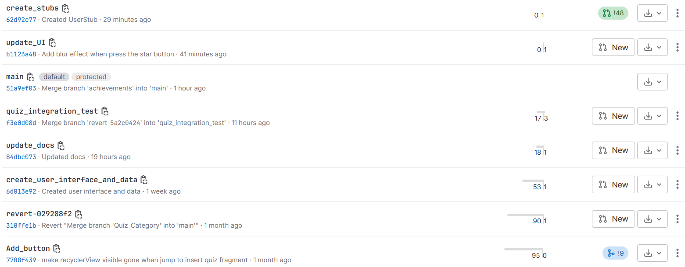

# Iteration 2 Worksheet

## Paying off technical debt
### Issue 1
**Debt:** [QuizNameCreateFragment Class](https://code.cs.umanitoba.ca/3350-summer2023/lakers-6/-/blob/main/app/src/main/java/comp3350/lakers/quizme/presentation/InsertQuizName/QuizNameCreateFragment.java#L85)

**Classification:** Prudent/deliberate

**Justification:** This is prudent/deliberate because we realized we were low on time remaining to complete the iteration and we just wanted the app to run.

**Explanation of how it's paid off:** This issue is that a TODO comment existed in a release. This TODO was in a class that was no longer needed, and thus the class was deleted which fixed the issue. [Commit link](https://code.cs.umanitoba.ca/3350-summer2023/lakers-6/-/commit/6ab0a6ec6de0febcac1f7c1cc831b33575e01904)

### Issue 2
**Debt:** [Inserting a quiz without validating input](https://code.cs.umanitoba.ca/3350-summer2023/lakers-6/-/blob/5a2c04248ddee2cdc33dfd3da36af67cba4d4964/app/src/main/java/comp3350/lakers/quizme/presentation/InsertQuiz/InsertQuizFragment.java#L76). [Same with this](https://code.cs.umanitoba.ca/3350-summer2023/lakers-6/-/blob/5a2c04248ddee2cdc33dfd3da36af67cba4d4964/app/src/main/java/comp3350/lakers/quizme/presentation/InsertQuiz/InsertQuizFragment.java#L115)

**Classification:** Prudent/Deliberate

**Justification:** This technical debt was prudent/deliberate because we wanted to get the app up and running so we did not do any validation when creating a new quiz. Therefore, we were able to create an empty quiz but it did its job.

**Explanation of how it's paid off:** We added a validation to prevent a user from creating an empty quiz. [Commit link](https://code.cs.umanitoba.ca/3350-summer2023/lakers-6/-/commit/7734dd8fe16a1939a19553ff689edc34271e8048#20346f9da0552263cddd506c4dde3a23a3bff1fd_0_1)

## SOLID
[Link to issue](https://code.cs.umanitoba.ca/3350-summer2023/ghostdevs-7/-/issues/50) 
## Retrospective
The retrospective helped foster more discussion between the team. 
- Merge requests have more comments now.
  - [link 1](https://code.cs.umanitoba.ca/3350-summer2023/lakers-6/-/merge_requests/47#notes)
  - [link 2](https://code.cs.umanitoba.ca/3350-summer2023/lakers-6/-/merge_requests/43#note_107746)
- Branch names now follow snake case

- There is no evidence that the time estimate helped as we did not keep track of it.
- Timelines are about the same.
- Testing is about the same

## Design patterns
Here are some of the design patterns that our project use:
| Design Pattern | Link |
|----------------|------|
| Singleton      |   [link](https://code.cs.umanitoba.ca/3350-summer2023/lakers-6/-/blob/main/app/src/main/java/comp3350/lakers/quizme/application/Services.java)   |
| Facade         |   [link](https://code.cs.umanitoba.ca/3350-summer2023/lakers-6/-/blob/main/app/src/main/java/comp3350/lakers/quizme/persistence/IQuiz.java)   |
| Iterator       |  [link](https://code.cs.umanitoba.ca/3350-summer2023/lakers-6/-/blob/main/app/src/main/java/comp3350/lakers/quizme/persistence/hsqldb/QuizPersistenceHSQLDB.java#L43)    |
| Observer  |  [link](https://code.cs.umanitoba.ca/3350-summer2023/lakers-6/-/blob/main/app/src/main/java/comp3350/lakers/quizme/presentation/CategoryListAdapter.java#L54) |

## Iteration 1 Feedback fixes

### Issue 1: Two instances of presentation in the logic layer.
This issue involved two strings that contain text that is displayed to the user being located in the logic layer rather than the presentations layer. This issue was fixed by moving the strings into the class QuizLayout in the presentation layer. Additionally in the QuizHandler class, the method getAnswer was created and checkAnswer was modified to pass the necessary information to presentation in order to use the strings. In QuizLayout the setFeedback method was created to utilize the strings and the classes QuizLayoutLongAnswer and QuizLayoutMultipleChoice were modified to use this new method.
#### Links:
- [Presentation in logic layer #1](https://code.cs.umanitoba.ca/3350-summer2023/lakers-6/-/blob/1.0.0/app/src/main/java/comp3350/lakers/quizme/logic/QuizHandler.java#L10)
- [Presentation in logic layer #2](https://code.cs.umanitoba.ca/3350-summer2023/lakers-6/-/blob/1.0.0/app/src/main/java/comp3350/lakers/quizme/logic/QuizHandler.java#L57)

#### Fix:
Fixed issues in response to iteration 1 feedback: [commit](https://code.cs.umanitoba.ca/3350-summer2023/lakers-6/-/commit/0198dfeb916feb924f95e9dde83502bb7a34a02c)

